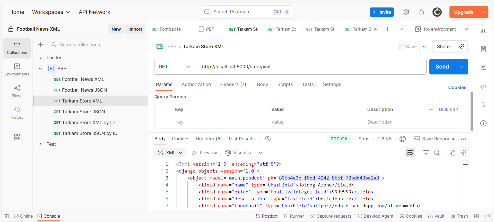
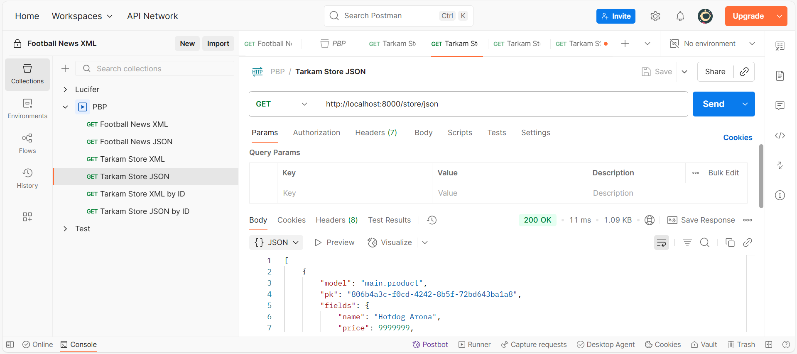
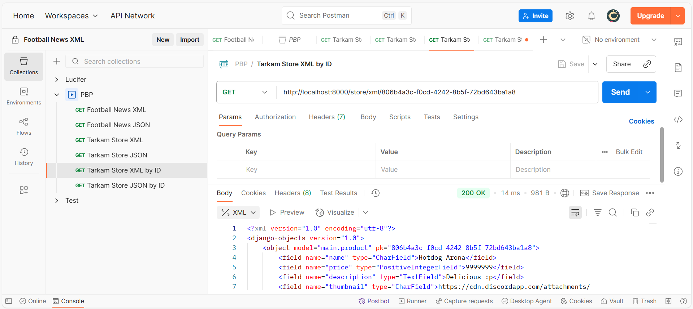
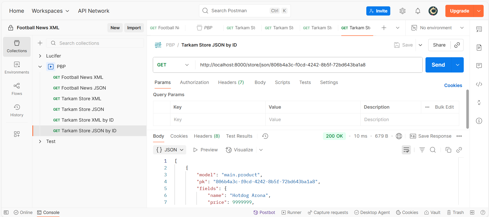

# Tarkam Store
Tautan Deployment: https://ahmad-yaqdhan-tarkamstore.pbp.cs.ui.ac.id/

Daftar Isi:
1. [Tugas Individu 2](#tugas-individu-2)
2. [Tugas Individu 3](#tugas-individu-3)
3. [Tugas Individu 4](#tugas-individu-4)
4. [Tugas Individu 5](#tugas-individu-5)

# Tugas Individu 2
## Soal 1
Langkah-langkah yang saya lakukan adalah sebagai berikut

### Checklist 1: Membuat sebuah proyek Django baru.
1. Membuat virtual environment untuk Python terlebih dahulu: `python -m venv env`
2. Mengaktifkan virtual env yang sudah dibuat: `env/Scripts/activate`
3. Membuat file `requirements.txt` yang kemudian diisi dengan dependensi yang diperlukan:
    ```
    django
    gunicorn
    whitenoise
    psycopg2-binary
    requests
    urllib3
    python-dotenv
    ```
4. Menginstall dependensi yang sudah ditulis: `pip install -r requirements.txt`
5. Membuat projek Django baru di folder ini: `django-admin startproject tarkam_store .`
6. Membuat file `.env` yang tiap-tiap key valuenya akan diload oleh program sebagai env variables:
    ```
    PRODUCTION=False
    ```
    Di sini di set `Production=False` karena ketika dijalankan di local, program dalam tahap pengembangan (belum masuk ke tahap production)
7. Membuat file `.env.prod` untuk mencatat env variables yang akan digunakan pada production:
    ```
    DB_NAME=<nama database>
    DB_HOST=<host database>
    DB_PORT=<port database>
    DB_USER=<username database>
    DB_PASSWORD=<password database>
    SCHEMA=tugas_individu
    PRODUCTION=True
    ```
8. Setelah itu, dilakukan set up pada file `tarkam_store/settings.py` sebagai berikut:
    - Me-load env variables yang ada di file `.env`:
        ```python
        import os
        from dotenv import load_dotenv
        # Load environment variables from .env file
        load_dotenv()

        ...
        ```
    - Menambahkan variabel `ALLOWED_HOSTS` dengan value sebagai berikut:
        ```python
        ...
        ALLOWED_HOSTS = ["localhost", "127.0.0.1"]
        ...
        ```
        Line ini berfungsi untuk memberitahu django bahwa web hanya akan bisa diakses melalui alamat-alamat tersebut.
    - Menambahkan variabel `PRODUCTION` dengan value sebagai berikut:
        ```python
        PRODUCTION = os.getenv('PRODUCTION', 'False').lower() == 'true'
        ```
        `PRODUCTION` berfungsi sebagai indikator apakah kita sedang berada di lingkungan production atau tidak. Variabel ini akan mengambil informasi berdasarkan apa yang sudah ditulis pada env variable sebelumnya.
    - Mengubah pengaturan `DATABASES` menjadi:
        ```python
        if PRODUCTION:
            DATABASES = {
                'default': {
                    'ENGINE': 'django.db.backends.postgresql',
                    'NAME': os.getenv('DB_NAME'),
                    'USER': os.getenv('DB_USER'),
                    'PASSWORD': os.getenv('DB_PASSWORD'),
                    'HOST': os.getenv('DB_HOST'),
                    'PORT': os.getenv('DB_PORT'),
                    'OPTIONS': {
                        'options': f"-c search_path={os.getenv('SCHEMA', 'public')}"
                    }
                }
            }
        else:
            DATABASES = {
                'default': {
                    'ENGINE': 'django.db.backends.sqlite3',
                    'NAME': BASE_DIR / 'db.sqlite3',
                }
            }
        ```
        Di sini, kita sesuaikan database yang akan digunakan untuk menyimpan data sesuai dengan apakah kita sedang di tahap production atau bukan. Apabila sudah diproduction, maka kita menggunakan database PostgreSQL dengan variabel-variabel yang sudah kita tulis di `.env.prod` sebelumnya. Namun apabila tidak, maka kita menggunakan database yang lebih simpel yaitu SQLite.

### Checklist 2: Membuat aplikasi dengan nama `main` pada proyek tersebut.
1. Membuat aplikasi dengan nama `main`: `python manage.py startapp main`

### Checklist 3: Melakukan _routing_ pada proyek agar dapat menjalankan aplikasi `main`.
1. Membuat folder `templates` di folder `main`
2. Membuat file `main.html` di folder `templates` yang berada di dalam `main`
    Isi dari `main.html`:
    ```html
    <h1>Halo!</h1>
    ```
3. Mengubah isi file `views.py` yang ada di folder `main` menjadi:
    ```python
    from django.shortcuts import render

    def show_main(request):
        context = {}

        return render(request, "main.html", context)
    ```
4. Membuat file `urls.py` di dalam folder `main`.
    Isi file `urls.py`:
    ```python
    from django.urls import path
    from main.views import show_main

    app_name = 'main'

    urlpatterns = [
        path('', show_main, name='show_main'),
    ]
    ```

5. Mengubah isi file `urls.py` yang ada di direktori proyek (`tarkam_store`) menjadi:
    ```python
    from django.contrib import admin
    from django.urls import path, include
    from django.views.generic.base import RedirectView

    urlpatterns = [
        path('admin/', admin.site.urls),
        path("store/", include("main.urls")),
        path("", RedirectView.as_view(url="/store/", permanent=True))
    ]
    ```

    Di sini dibuat agar ketika user mengakses `<url>/store`, maka akan memunculkan aplikasi `main`. Lalu apabila user mengakses `<url>/`, user akan diredirect ke `<url>/store/`.

### Checklist 4: Membuat model pada aplikasi `main` dengan nama `Product`
1. Mengubah isi file `models.py` yang ada di direktori `main` menjadi:
    ```python
    import uuid
    from django.db import models

    class Product(models.Model):
        CATEGORIES = [
            ("shoes", "Shoes"),
            ("clothes", "Clothes"),
            ("accessories", "Accessories"),
            ("balls", "Balls"),
            ("other", "Other")
        ]

        id = models.UUIDField(primary_key=True, default=uuid.uuid4, editable=False)
        name = models.CharField(max_length=100)
        price = models.PositiveIntegerField()
        description = models.TextField()
        thumbnail = models.URLField(blank=True, null=True)
        category = models.CharField(max_length=20, choices=CATEGORIES, default="other")
        is_featured = models.BooleanField(default=False)

        def __str__(self):
            return self.name
    ```
2. Membuat migrasi dari model yang baru saja dibuat: `python manage.py makemigrations`
3. Menerapkan migrasi pada database lokal: `python manage.py migrate`

### Checklist 5: Membuat sebuah fungsi pada `views.py` untuk dikembalikan ke dalam sebuah _template_ HTML
1. Mengubah isi file `views.py` yang ada di folder `main` menjadi:
    ```python
    from django.shortcuts import render

    def show_main(request):
        context = {
            "app_name": "Tarkam Store",
            "name": "Ahmad Yaqdhan",
            "class": "PBP A",
            "npm": 2406399081,
            "message": "Coming soon!"
        }

        return render(request, "main.html", context)
    ```
2. Mengubah isi file `main.html` yang ada di folder `main/templates`:
    ```html
    <h1>{{ app_name }}</h1>

    <h4>Nama</h4>
    <p>{{ name }}</p>

    <h4>Kelas</h4>
    <p>{{ class }}</p>

    <h4>NPM</h4>
    <p>{{ npm }}</p>

    <h4>Message:</h4>
    <p>{{ message }}</p>
    ```

### Checklist 6: Membuat sebuah routing pada `urls.py` aplikasi `main` untuk memetakan fungsi yang telah dibuat pada `views.py`.
Tahap ini sudah dilakukan bersamaan dengan checklist 3, dimana kita sudah menambahkan penggunaan fungsi `show_main` pada routing yang berada di file `urls.py`.

### Checklist 7: Melakukan _deployment_ ke PWS
1. Membuat project baru di [PWS](https://pbp.cs.ui.ac.id/), di sini saya menggunakan nama `tarkamstore` untuk projectnya
2. Menambahkan `"<username>-tarkamstore.pbp.cs.ui.ac.id"` ke array `ALLOWED_HOSTS` yang ada di file `settings.py`:
    ```python
    ...
    ALLOWED_HOSTS = ["localhost", "127.0.0.1", "ahmad-yaqdhan-tarkamstore.pbp.cs.ui.ac.id"]
    ...
    ```
    Perhatikan bahwa url yang saya tulis di contoh kode atas menyesuaikan dengan username saya yaitu `ahmad.yaqdhan`. Silahkan ubah string url tersebut sesuai dengan username anda. Jangan lupa untuk mengubah simbol titik menjadi strip `-` apabila username anda mengandung titik.
3. Salin kredensial yang ditampilkan ke tempat lain terlebih dahulu
4. Membuka menu `Environs` dan memasukkan env variabel yang sudah ditulis sebelumnya di file `.env.prod` melalui tombol `Raw Editor` yang ada di menu `Environs`.
5. Menjalankan perintah pada konsol / terminal sebagai berikut:
    ```
    git remote add pws "https://pbp.cs.ui.ac.id/ahmad.yaqdhan/tarkamstore.git"
    git branch -M master
    git push pws master
    ```

    Perlu diperhatikan bahwa pada perintah di atas, url git yang saya tulis menyesuaikan dengan username SCELE saya yaitu `ahmad.yaqdhan`.
    Silahkan ganti ke username yang sesuai untuk akun SCELE anda.
6. Ketika perintah yang terakhir dijalankan, seharusnya git menanyakan username dan password. Di sini, masukkan kredensial yang kita salin sebelumnya pada tahap 3.
7. Setelah selesai push, program seharusnya sudah berhasil dideploy.

## Soal 2
Gambar bagan terdapat di file `docs/images/Bagan Tugas 2 PBP.png`. Apabila README ini dibuka melalui preview markdown, maka seharusnya muncul di bawah ini:


## Soal 3
Peran `settings.py` adalah untuk mendefinisikan beberapa variabel yang nantinya akan diimport oleh sistem django sebagai konfigurasi dari aplikasi yang akan dijalankan. Tentunya karena `settings.py` adalah file konfigurasi, maka file ini dijalankan terlebih dahulu sebelum bagian lain seperti routing dan views dijalankan.

## Soal 4
Migrasi database bekerja dengan membaca model yang dituliskan di tiap-tiap appp ada projek Django. Apabila terdapat perubahan dalam bentuk model, maka migrasi akan dilakukan. Fungsi dari migrasi sendiri kurang lebih mirip dengan fungsi Git, namun khusus untuk model data. Migrasi dilakukan agar perubahan terhadap model tercatat, sehingga apabila terjadi sesuatu yang tidak diinginkan dengan bentuk model yang baru maka bisa kita gunakan model yang lama.

## Soal 5
Menurut saya, alasan mengapa Django dijadikan permulaan pembelajaran pengembangan perangkat lunak adalah karena Django dibangun menggunakan bahasa Python. Bahasa Python sendiri memiliki keunggulan yaitu ramah pemula karena sintaksnya yang mudah dipahami serta ekosistemnya yang besar. Oleh karena sebab ini juga, bahasa Python adalah bahasa yang paling umum digunakan dalam  


## Soal 6
Tidak ada :)
Tutorial 1 mudah untuk diikuti dan dipahami.

# Tugas Individu 3

## Soal 1: Jelaskan mengapa kita memerlukan _data delivery_ dalam pengimplementasian sebuah platform?
_data delivery_ diperlukan karena bagian front-end dan back-end dipisah. Agar mereka bisa berinteraksi satu sama lain, perlu adanya proses mengirim dan menerima data antar kedua bagian ini. Disinilah _data delivery_ terjadi. Bagian front-end akan menginterpretasi input dari user menjadi suatu data yang bisa dibaca oleh server / back-end. Kemudian, back-end akan memproses data tersebut. Umumnya data tersebut akan disimpan di suatu database, atau ditransformasi lebih lanjut. Setelah back-end selesai memproses data, back-end menghubungi kembali front-end untuk memberikan informasi mengenai data yang tadi dikirim. Seperti itulah kerja _data delivery_ dalam sebuah aplikasi terjadi.

## Soal 2: Menurutmu, mana yang lebih baik antara XML dan JSON? Mengapa JSON lebih populer dibandingkan XML?
Menurut saya, JSON lebih populer dibanding XML karena JSON lebih mudah untuk diinteraksikan melalui bahasa scripting frontend yaitu JS. Tak hanya itu, sintaks JSON lebih simpel dan lebih ringan dalam menyimpan data dibandingkan XML. Dapat dilihat dengan contoh berikut:

Data di XML:
```xml
<product>
    <name>Sepatu Bola</name>
    <description>Sepatu keren berkelas tinggi.</description>
    <category>shoes</category>
</product>
```

Data yang sama apabila disimpan dengan JSON
```json
{
    "name": "Sepatu Bola",
    "description": "Sepatu keren berkelas tinggi.",
    "category": "shoes"
}
```

Dapat dilihat di atas bahwa pada XML, untuk menutup data, diperlukan sebuah closing tag yang panjangnya sama dengan opening tag. Hal ini tentunya membuat data lebih berat ketika disimpan. Tak hanya itu, pada JSON nama dari schema atau objek tidak perlu dideklarasikan. Dari sini dapat dilihat bahwa JSON memiliki sintaks yang lebih simpel dibandingkan XML.

## Soal 3: Jelaskan fungsi dari method `is_valid()` pada form Django dan mengapa kita membutuhkan method tersebut?
Fungsi dari metode `is_valid()` adalah untuk memvalidasi isi dari form yang diterima dari front-end. Validasi ini disesuaikan dengan model asli yang kita buat di Django. Validasi dilakukan agar tipe data yang diterima sesuai dengan apa yang kita inginkan. Sebagai contoh, kita ingin agar nama dari produk tidak lebih dari 32 karakter. Maka diperlukan validasi agar ketika user mengirim nama produk yang lebih dari 32 karakter, maka produk tidak diproses oleh program.

## Soal 4: Mengapa kita membutuhkan `csrf_token` saat membuat form di Django? Apa yang dapat terjadi jika kita tidak menambahkan `csrf_token` pada form Django? Bagaimana hal tersebut dapat dimanfaatkan oleh penyerang?
CSRF token digunakan untuk menghindari serangan CSRF. CSRF (Cross-Site Request Forgery) adalah sebuah serangan dimana penyerang mengelabui user atau browser yang digunakan oleh user untuk melakukan request ke suatu website yang menjadi target serangan melalui website penyerang. Request yang dilakukan di sini mengandung kredensial user, sehingga server menganggap bahwa memang user tersebut dengan sengaja melakukan request tersebut. Di sinilah dimana `csrf_token` digunakan. Server Django akan menaruh sebuah token berupa string random pada cookie user. Kemudian, token yang sudah ditaruh pada cookie user diproses sedemikian rupa sehingga susah untuk diprediksi serta berbeda dengan yang ada di cookie user. Token yang sudah diproses tersebut adalah `csrf_token` yang akan kita taruh pada sebuah form yang ingin diamankan. Nantinya ketika server menerima request pada server terkait form tersebut, server akan mencocokkan cookie dengan token csrf. Apabila ditemukan bahwa cookie tidak ada, token tidak ada, ataupun token bukanlah hasil pemrosesan dari cookie csrf maka request tersebut tidak diproses dan server akan memberikan response dengan code 403 (Forbidden).

## Soal 5: Jelaskan bagaimana cara kamu mengimplementasikan _checklist_ di atas secara _step-by-step_ (bukan hanya sekadar mengikuti tutorial).

### Checklist 1: Tambahkan 4 fungsi `views` baru untuk melihat objek yang sudah ditambahkan dalam format XML, JSON, XML _by ID_, dan JSON _by ID_.
1. Saya tambahkan terlebih dahulu import berikut di bagian atas file `views.py` yang ada di folder `main`:
    ```python
    ...
    from django.http import HttpResponse
    from django.core import serializers
    from main.models import Product

    ...
    ```

2. Saya buat 4 fungsi untuk menampilkan data yang sudah ditambahkan dalam format XML, JSON, XML _by ID_, dan JSON _by ID_ pada file `views.py` yang ada di folder `main`:
    ```python
    ...

    def show_xml(request):
        products = Product.objects.all()
        data = serializers.serialize("xml", products)
        return HttpResponse(data, content_type="application/xml")

    def show_json(request):
        products = Product.objects.all()
        data = serializers.serialize("json", products)
        return HttpResponse(data, content_type="application/json")

    def show_xml_by_id(request, id):
        products = Product.objects.filter(pk=id)
        data = serializers.serialize("xml", products)
        return HttpResponse(data, content_type="application/xml")

    def show_json_by_id(request, id):
        products = Product.objects.filter(pk=id)
        data = serializers.serialize("json", products)
        return HttpResponse(data, content_type="application/json")
    ```

### Checklist 2: Membuat routing URL untuk masing-masing `views` yang telah ditambahkan pada poin 1.
1. Saya import terlebih dahulu fungsi yang sudah saya buat pada poin 1 di bagian atas file `urls.py` yang ada di folder `main`:
    ```python
    ...
    from main.views import show_main, create_product, show_product, show_xml, show_json, show_xml_by_id, show_json_by_id

    ...
    ```
2. Saya tambahkan fungsi-fungsi tersebut ke dalam routing nya masing-masing di file `urls.py` yang ada di folder `main`:
    ```python
    ...

    urlpatterns = [
        ...
        path("xml/", show_xml, name="show_xml"),
        path("json/", show_json, name="show_json"),
        path("xml/<str:id>/", show_xml_by_id, name="show_xml_by_id"),
        path("json/<str:id>/", show_json_by_id, name="show_json_by_id"),
    ]
    ```

### Checklist 3: Membuat halaman yang menampilkan data objek model yang memiliki tombol "Add" yang akan redirect ke halaman `form`, serta tombol "Detail" pada setiap data objek model yang akan menampilkan halaman detail objek.
1. Saya buat terlebih dahulu sebuah class form untuk model `Product` yang akan digunakan sebagai bentuk data yang akan diisi dan dikirim oleh user. Class form ini saya buat di file `forms.py` di folder `main`:
    ```python
    from django.forms import ModelForm
    from main.models import Product

    class ProductForm(ModelForm):
        class Meta:
            model = Product
            fields = ['name', 'price', 'description', 'thumbnail', 'category', 'is_featured']
    ```
2. Saya mengimport terlebih dahulu form yang sudah saya buat di file `views.py` yang ada di folder `main`:
    ```python
    ...
    from main.forms import ProductForm
    
    ...
    ```
3. Saya menambahkan tiga fungsi pada file `views.py` yang ada di folder `main`:
    ```python
    def show_product_list(request):
        product_list = Product.objects.all()

        context = {
            "product_list": product_list
        }

        return render(request, "product_list.html", context)

    def create_product(request):
        form = ProductForm(request.POST or None)

        if form.is_valid() and request.method == "POST":
            form.save()
            return redirect("main:show_main")

        context = {"form": form}
        return render(request, "create_product.html", context)

    def show_product(request, id):
        product = get_object_or_404(Product, pk=id)

        context = {
            "product": product
        }
        return render(request, "product_details.html", context)
    ```

    - Fungsi `show_product_list` akan merender suatu halaman yang menampilkan semua produk yang sudah dibuat
    - Fungsi `create_product` akan merender suatu halaman `form` yang nantinya dapat diisi oleh user. Tak hanya merender, `create_product` juga akan menerima dan menyimpan data yang dikirimkan user dari halaman `form`
    - Fungsi `show_product` akan merender suatu halaman yang akan menampilkan data lengkap dari suatu produk tertentu
4. Sama halnya seperti pada poin 2, kita akan mengimport dan menambah routing untuk fungsi-fungsi tersebut di file `urls.py` yang ada di folder `main`:
    ```python
    ...
    from main.views import show_main, show_product_list, create_product, show_product, show_xml, show_json, show_xml_by_id, show_json_by_id

    ...

    urlpatterns = [
        ...
        path("create-product/", create_product, name="create_product"),
        path("products/", show_product_list, name="show_product_list"),
        path("products/<str:id>/", show_product, name="show_product"),
        ...
    ]
    ```
5. Sebelum membuat kode HTML untuk masing-masing halaman, saya membuat template untuk seluruh page terlebih dahulu. Template ini saya taruh di file `base.html` di folder `templates`:
    ```html
    
    <!DOCTYPE html>
    <html lang="en">
    <head>
        <meta charset="UTF-8">
        <meta name="viewport" content="width=device-width, initial-scale=1.0">
         
    </head>
    <body>
         
    </body>
    </html>
    ```
    Template ini berguna agar kita dapat menambahkan beberapa tag dan metadata yang akan digunakan di semua halaman tanpa perlu menulis ulang setiap kali membuat halaman baru.
6. Saya tambahkan template yang sudah saya buat tadi ke properti `TEMPLATES` pada file `settings.py` yang ada di folder `tarkam_store` agar template tadi terdaftar di server Django dan dapat digunakan di semua halaman:
    ```python
    ...

    TEMPLATES = [
        {
            ...
            'DIRS': [BASE_DIR / "templates"],
            'APP_DIRS': True,
            ...
        },
    ]

    ...
    ```

7. Saya buat kode HTML untuk masing-masing halaman:
    - `main/templates/create_product.html`:
        ```html
        
        
        <h1>Create New Product</h1>

        <form method="POST">
            
            <table>
                {{ form.as_table }}

                <tr>
                    <td></td>
                    <td>
                        <input type="submit" value="Add Product" />
                    </td>
                </tr>
            </table>
        </form>
        
        ```
    - `main/templates/product_details.html`
        ```html
        
        
        <p><a href=""><button>← Back to Product List</button></a></p>

        <h1>{{ product.name }}</h1>
        <p><b>{{ product.get_category_display }}</b> | <b>Featured</b> | <i>{{ product.created_at|date:"d M Y H:i" }}</i></p>

        
            
            <br /><br />
        

        <p>{{ product.description }}</p>

        
        ```
    - `main/templates/product_list.html`:
        ```html
        
        
        <p><a href=""><button>← Back to Home</button></a></p>

        <h1>Product List</h1>

        <a href="">
            <button>+ Add Product</button>
        </a>

        
            
                <div>
                    <h2><a href="">{{ product.name }}</a></h2>

                    <p><b>{{ product.get_category_display }}</b> | <b>Featured</b> | <i>{{ product.created_at|date:"d M Y H:i" }}</i></p>

                    
                        
                        <br />
                    

                    <p>{{ product.description|truncatewords:25 }}...</p>

                    <p><a href=""><button>View Details</button></a></p>
                </div>

                <hr />
            
        
            <p>No product is available.</p>
        

        
        ```
8. Saya modifikasi HTML halaman utama yang berada di file `main/templates/main.html` agar menggunakan template `base.html` dan menampilkan button untuk user membuat halaman daftar produk:
    ```html
    
    
    <h1>{{ app_name }}</h1>

    <h4>Nama</h4>
    <p>{{ name }}</p>

    <h4>Kelas</h4>
    <p>{{ class }}</p>

    <h4>NPM</h4>
    <p>{{ npm }}</p>

    <h4>Message:</h4>
    <p>{{ message }}</p>

    <a href="">
        <button>See Product List</button>
    </a>

    
    ```

### Checklist 4: Membuat halaman `form` untuk menambahkan objek model pada app sebelumnya.
Halaman ini sudah dibuat pada poin 3, dimana kita membuat sebuah routing untuk `create-products/` dengan fungsinya yaitu `create_product`.

### Checklist 5: Membuat halaman yang menampilkan detail dari setiap data objek model.
Halaman ini sudah dibuat pada poin 3, dimana kita membuat sebuah routing untuk `products/<str:id>/` dengan fungsinya yaitu `show_product`.

## Soal 6: Apakah ada feedback untuk asdos di tutorial 2 yang sudah kalian kerjakan?
Dari saya sendiri tidak ada.
Tutorial masih bisa diikuti :)

## Gambar / Screenshot Request Postman

### XML
File gambar: `docs/images/PostmanXML.png`



### JSON
File gambar: `docs/images/PostmanJSON.png`



### XML by ID
File gambar: `docs/images/PostmanXMLByID.png`



### JSON by ID
File gambar: `docs/images/PostmanJSONByID.png`



# Tugas Individu 4

## Soal 1: Apa itu Django `AuthenticationForm`? Jelaskan juga kelebihan dan kekurangannya.
`AuthenticationForm` adalah sebuah model form autentikasi bawaan dari Django. Form ini berisi 2 field, yaitu username dan password.

Kelebihan dari `AuthenticationForm` adalah bahwa tiap-tiap field sudah divalidasi oleh Django, jadi kita tidak perlu khawatir tentang isi username dan password. Kekurangannya adalah form ini kurang customizable dengan bagaimana cara Django berinteraksi dengan data dan form yang mereka miliki. Mereka tidak men-design kasus handling ketika ada field tambahan seperti captcha key, sehingga ketika kita menggunakan pengecekan built-in pasti ada hal yang tidak tercek oleh Django.

## Soal 2: Apa perbedaan antara autentikasi dan otorisasi? Bagaimana Django mengimplementasikan kedua konsep tersebut?
Autentikasi adalah proses dimana program atau web mengenali dan mengidentifikasikan kita sebagai pengguna. Pada Django, ini dilakukan dengan menggunakan `AuthenticationForm` untuk melakukan autentikasi berdasarkan username dan password pengguna.

Otorisasi adalah proses dimana program atau web memberikan hak / izin untuk melakukan sesuatu sesuai dengan identitas yang didapat dari proses Autentikasi. Pada Django, ini bisa dilakukan dengan berbagai cara. Namun pada kasus program ini, kita gunakan salah satu cara otorisasi yaitu decorator `login_required`. Decorator ini akan mengecek terlebih dahulu request dari pengguna, apakah pengguna sudah login atau belum. Apabila sudah, maka pengguna memiliki otorisasi untuk melakukan request tersebut sehingga Django akan memproses request. Namun jika belum, maka Django tidak akan memproses request lebih lanjut.

## Soal 3: Apa saja kelebihan dan kekurangan _session_ dan _cookies_ dalam konteks menyimpan _state_ di aplikasi web?
1. Session
    - Kelebihan: Menyimpan data hanya di server, sehingga lebih aman. Ukuran data yang bisa disimpan pun juga besar
    - Kekurangan: Berakhir setelah browser ditutup ataupun ketika session timeout
2. Cookie
    - Kelebihan: Data login tersimpan di komputer user melalui browser yang digunakan, sehingga user dapat tetap terautentikasi ketika mereka membuka kembali browser.
    - Kekurangan: Cookie dapat digunakan oleh penyerang untuk masuk ke dalam sistem sebagai pengguna lain

## Soal 4: Apakah penggunaan _cookies_ aman secara _default_ dalam pengembangan web, atau apakah ada risiko potensial yang harus diwaspadai? Bagaimana Django menangani hal tersebut?
Tentunya masih ada risiko potensial yang harus diwaspadai. Dari tugas individu 2, sudah dibahas mengenai CSRF. CSRF ini juga menjadi salah satu hal yang bisa terjadi karena sistem cookies pada web browser. Django menangani masalah ini dengan menambahkan CSRF token sebagai validasi tambahan ketika menerima permintaan perubahan data.

## Soal 5: Jelaskan bagaimana cara kamu mengimplementasikan checklist di atas secara step-by-step (bukan hanya sekadar mengikuti tutorial).

### Checklist 1: Mengimplementasikan fungsi registrasi, login, dan logout untuk memungkinkan pengguna mengakses aplikasi sebelumnya sesuai dengan status login/logoutnya.
1. Saya menambahkan import-import berikut terlebih dahulu pada file `main/views.py`:
    ```python
    ...

    from django.contrib.auth.forms import AuthenticationForm, UserCreationForm
    from django.contrib.auth.decorators import login_required
    from django.contrib.auth import login, logout
    from django.contrib import messages

    from django.http import HttpResponseRedirect
    from django.urls import reverse

    ...
    ```

2. Masih di file yang sama, saya membuat tiga request handler baru untuk registrasi, login, dan logout:
    ```python
    def register(request):
    form = UserCreationForm()

    if request.method == "POST":
        form = UserCreationForm(request.POST)
        if form.is_valid():
            form.save()
            messages.success(request, "Your account has been successfully created")
            return redirect("main:login")

    context = { "form": form }
    return render(request, "register.html", context)

    def login_user(request):
        if request.method == "POST":
            form = AuthenticationForm(data=request.POST)

            if form.is_valid():
                user = form.get_user()
                login(request, user)

                response = HttpResponseRedirect(reverse("main:show_main"))

                return response

        else:
            form = AuthenticationForm(request)

        context = { "form": form }
        return render(request, "login.html", context)

    def logout_user(request):
        logout(request)

        response=HttpResponseRedirect(reverse("main:login"))

        return response
    ```

3. Masih di file yang sama, saya ubah tiap-tiap fungsi request yang menggunakan render agar membutuhkan login untuk bisa diakses:
    ```python
    @login_required(login_url="/store/login")
    def show_main(request):
        ...

    @login_required(login_url="/store/login")
    def show_product_list(request):
        ...

    @login_required(login_url="/store/login")
    def create_product(request):
        ...

    @login_required(login_url="/store/login")
    def show_product(request):
        ...
    ```

4. Saya buat template untuk fungsi registrasi dan login:
    - `main/templates/register.html`
        ```html
        

        
        <title>Register</title>
        

        

        <div>
        <h1>Register</h1>

        <form method="POST">
            
            <table>
            {{ form.as_table }}
            <tr>
                <td></td>
                <td><input type="submit" name="submit" value="Daftar" /></td>
            </tr>
            </table>
        </form>

        
        <ul>
            
            <li>{{ message }}</li>
            
        </ul>
        
        </div>

        
        ```
    - `main/templates/login.html`
        ```html
        

        
        <title>Login</title>
        

        
        <div class="login">
        <h1>Login</h1>

        <form method="POST" action="">
            
            <table>
            {{ form.as_table }}
            <tr>
                <td></td>
                <td><input class="btn login_btn" type="submit" value="Login" /></td>
            </tr>
            </table>
        </form>

        
        <ul>
            
            <li>{{ message }}</li>
            
        </ul>
         Don't have an account yet?
        <a href="">Register Now</a>
        </div>

        
        ```
5. Terakhir, saya menambahkan fungsi-fungsi request handler yang baru saja saya buat ke `main/urls.py`:
    ```python
    ...
    from main.views import show_main, show_product_list, create_product, show_product, show_xml, show_json, show_xml_by_id, show_json_by_id, register, login_user, logout_user

    ...

    urlpatterns = [
        ...

        path("register/", register, name="register"),
        path("login/", login_user, name="login"),
        path("logout/", logout_user, name="logout")
    ]
    ```

### Checklist 2: Membuat **dua** (2) akun pengguna dengan masing-masing **tiga** (3) _dummy data_ menggunakan model yang telah dibuat sebelumnya untuk setiap akun **di lokal**.
Saya lakukan ini dengan membuat dua akun melalui halaman register yang sudah saya buat sebelumnya. Setelah membuat kedua akun tersebut, saya login dan kemudian membuat tiga produk di masing-masing akun tersebut.

### Checklist 3: Menghubungkan model `Product` dengan `User`.
1. Saya menambahkan `User` ke model `Product` di atribut `user`:
    ```python
    ...
    from django.contrib.auth.models import User

    class Product(models.Model):
        ...
        user = models.ForeignKey(User, on_delete=models.CASCADE, null=True)
        ...
    ```
2. Saya membuat dan melakukan migration
    ```
    python manage.py makemigrations main
    python manage.py migrate
    ```
3. Saya memodifikasi fungsi `create_product` pada `main/views.py` sehingga user yang membuat product dimasukkan ke product sebagai atribut `user`:
    ```python
    @login_required(login_url="/store/login")
    def create_product(request):
        form = ProductForm(request.POST or None)

        if form.is_valid() and request.method == "POST":
            product_entry = form.save(commit=False)
            product_entry.user = request.user
            product_entry.save()

            return redirect("main:show_main")

        context = {"form": form}
        return render(request, "create_product.html", context)
    ```
4. Saya menambahkan data mengenai penjual pada data produk yang tampil di `main/templates/product_details.html` dan `main/templates/product_list.html`:
    ```html
    ...

    <p><b>{{ product.get_category_display }}</b>
         | <b>Featured</b>
        | <b>Seller: {{product.user.username}}???</b>
    </p>

    ...
    ```

### Checklist 4: Menampilkan detail informasi pengguna yang sedang _logged in_ seperti _username_ dan menerapkan _cookies_ seperti `last_login` pada halaman utama aplikasi.
1. Saya memodifikasi fungsi `show_main`, `login`, `logout` pada `main/views.py` agar menggunakan cookie `last_login` dan dapat menampilkan username`:
    ```python
    ...
    import datetime

    ...

    @login_required(login_url="/store/login")
    def show_main(request: HttpRequest):
        context = {
            "app_name": "Tarkam Store",
            "name": "Ahmad Yaqdhan",
            "class": "PBP A",
            "npm": 2406399081,
            "message": "Coming soon!",
            "last_login": request.COOKIES.get("last_login", "Never"),
            "username": request.user.username
        }

        return render(request, "main.html", context)

    ...

    def login_user(request):
    if request.method == "POST":
        form = AuthenticationForm(data=request.POST)

        if form.is_valid():
            user = form.get_user()
            login(request, user)

            response = HttpResponseRedirect(reverse("main:show_main"))
            response.set_cookie("last_login", str(datetime.datetime.now()))

            return response

    else:
        form = AuthenticationForm(request)

    context = { "form": form }
    return render(request, "login.html", context)

    def logout_user(request):
        logout(request)

        response=HttpResponseRedirect(reverse("main:login"))
        response.delete_cookie("last_login")

        return response
    ```

2. Saya taruh `last_login` dan `username` (yang sudah saya tambahkan tadi ke context `show_main`) di `main/templates/main.html`:
    ```html
    ...

    <a href="">
        <button>See Product List</button>
    </a>

    <h3>User Info</h3>

    <h5>Username: {{ username }}</h5>
    <h5>Last Login: {{ last_login }}</h5>

    ...
    ```

# Tugas Individu 5
## Soal 1: Jika terdapat beberapa CSS selector untuk suatu elemen HTML, jelaskan urutan prioritas pengambilan CSS selector tersebut!
Browser akan memilih style untuk atribut pada suatu elemen tertentu dengan urutan sebagai berikut:
1. Inline CSS
2. ID selector
3. Class selector
4. Tag selector

## Soal 2: Mengapa _responsive design_ menjadi konsep yang penting dalam pengembangan aplikasi _web_? Berikan contoh aplikasi yang sudah dan belum menerapkan _responsive design_, serta jelaskan mengapa!
Responsive design penting sebagai konsep pengembangan aplikasi web karena aplikasi akan diakses tidak hanya dari desktop, tetapi juga dengan perangkat dengan layar kecil seperti perangkat mobile. 

Contoh aplikasi yang belum menerapkan responsive design adalah aplikasi yang kita buat sebelum Tugas Individu 5. Aplikasi tidak menghandle styling ketika aplikasi dibuka pada layar lebih kecil.

Contoh aplikasi yang sudah menerapkan responsive design adalah aplikasi yang baru saja kita tambah styling responsive. Selain dari itu, SCELE juga salah satu contoh aplikasi yang responsive.

## Soal 3: Jelaskan perbedaan antara _margin_, _border_, dan _padding_, serta cara untuk mengimplementasikan ketiga hal tersebut!
Margin adalah jarak yang kita berikan pada bagian luar dari elemen sehingga elemen menjauh dari elemen lain di sekitarnya.

Border adalah garis yang bisa kita tambah sebagai pembatas pada ujung-ujung elemen.

Padding adalah jarak yang kita berikan pada bagian dalam dari elemen sehingga anak dari elemen tersebut menjauh ke dalam elemen.

## Soal 4: Jelaskan konsep _flex box_ dan _grid layout_ beserta kegunaannya!
Flexbox adalah konsep penataan atau peletakan elemen-elemen dalam baris atau kolom. Flexbox hanya bisa menerapkan salah satu dari peletakan baris atau kolom saja.

Grid layout adalah konsep penataan atau peletakan elemen-elemen dalam bentuk 2 dimensi. Penataan pada grid layout ini mirip dengan sebuah tabel dimana terdapat kolom dan baris, serta tiap-tiap selnya adalah anak dari elemen tersebut.

## Soal 5: Jelaskan bagaimana cara kamu mengimplementasikan _checklist_ di atas secara _step-by-step_ (bukan hanya sekadar mengikuti tutorial)!
### Checklist 1: Implementasikan fungsi untuk menghapus dan mengedit product.
1. Saya buat terlebih dahulu fungsi views yang akan meng-handle request edit dan hapus product di file `main/views.py`:
    ```python
    ...

    @login_required(login_url="/store/login")
    def edit_product(request: HttpRequest, id):
        product = get_object_or_404(Product, pk=id)
        if not product.user or product.user.pk != request.user.pk:
            return HttpResponseRedirect(reverse("main:show_product_list"))

        form = ProductForm(request.POST or None, instance=product)
        if form.is_valid() and request.method == "POST":
            form.save()
            return redirect("main:show_product_list")

        context = {
            "form": form
        }
        return render(request, "edit_product.html", context)

    @login_required(login_url="/store/login")
    def delete_product(request, id):
        product = get_object_or_404(Product, pk=id)
        product.delete()
        return HttpResponseRedirect(reverse("main:show_product_list"))

    ...
    ```

2. Saya menambahkan fungsi yang sudah saya buat ke `main/urls.py` agar dapat dimetakan ke suatu path yang nantinya bisa direquest oleh user:
    ```python
    ...
    from main.views import show_main, show_product_list, create_product, show_product, show_xml, show_json, show_xml_by_id, show_json_by_id, register, login_user, logout_user, edit_product, delete_product

    ...

    urlpatterns = [
        ...
        path("products/<uuid:id>/edit/", edit_product, name="edit_product"),
        path("products/<uuid:id>/delete/", delete_product, name="delete_product")
    ]
    ```
3. Saya membuat file `edit_product.html` yang digunakan untuk merender form edit product

### Checklist 2: Kustomisasi desain pada template HTML yang telah dibuat pada tugas-tugas sebelumnya menggunakan CSS atau CSS framework
1. Saya menambahkan handler static file terlebih dahulu pada file `tarkam_store/settings.py`:
    ```python
    ...

    MIDDLEWARE = [
        'django.middleware.security.SecurityMiddleware',
        'whitenoise.middleware.WhiteNoiseMiddleware',
        ...
    ]

    ...

    STATIC_URL = '/static/'
    if DEBUG:
        STATICFILES_DIRS = [
            BASE_DIR / 'static'
        ]
    else:
        STATIC_ROOT = BASE_DIR / 'static'
2. Saya menambahkan file `static/css/global.css` sebagai styling yang akan digunakan oleh aplikasi dan file `static/image/no-product.png` sebagai placeholder gambar untuk kasus ketika tidak ada product yang sudah dibuat.
3. Saya membuat navbar di `templates/navbar.html`. Navbar ini akan dipakai oleh homepage dan halaman product list.
4. Saya membuat card untuk product di `main/templates/product_card.html`. Card dibuat dalam file terpisah agar pengelolaan mudah dan juga agar bisa digunakan ulang di elemen lain.
5. Saya menambahkan styling pada tiap-tiap halaman yang sudah saya buat.
